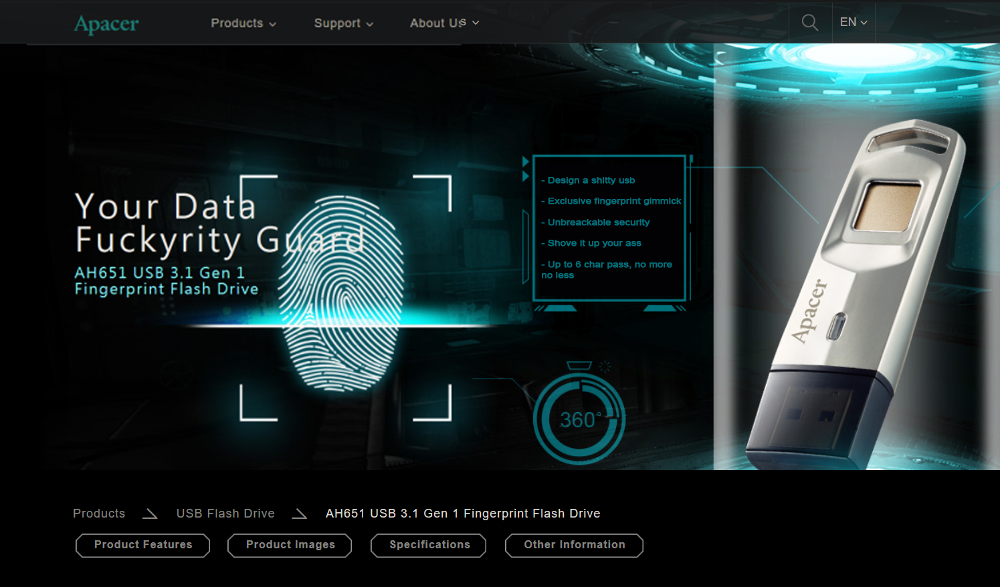

## PoCs for retarded ass "SECURE" drives

### Apacer AH651/AH650 - https://consumer.apacer.com/eng/content.php?sn=1577

- Appotech DM8381 (Can just resolder the NAND to another drive or attach directly to DM8381)

- Fingerprint sensor gimmick

- DeviceIoControl used to unlock the drive

- No password attempt rate limits

- No encryption `¯\(°_o)/¯`

- 27 USD to get royally scammed by chinks

3000, bin was here